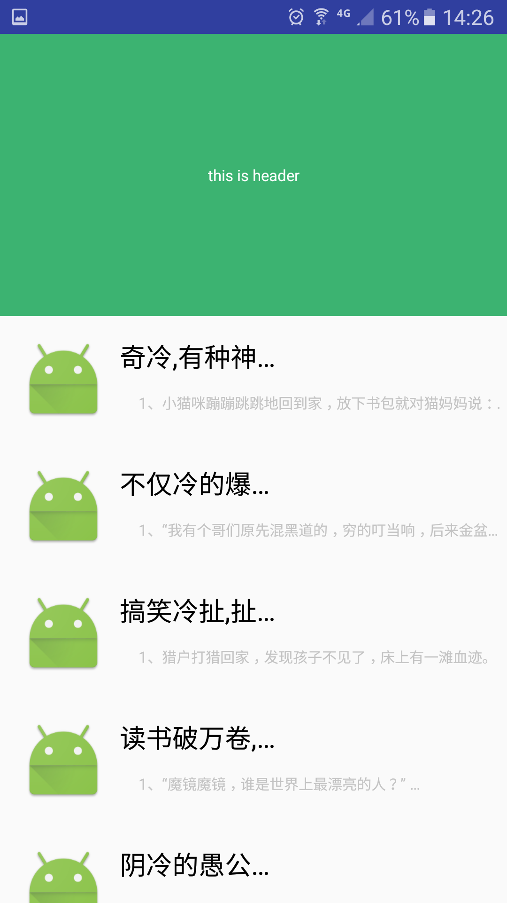
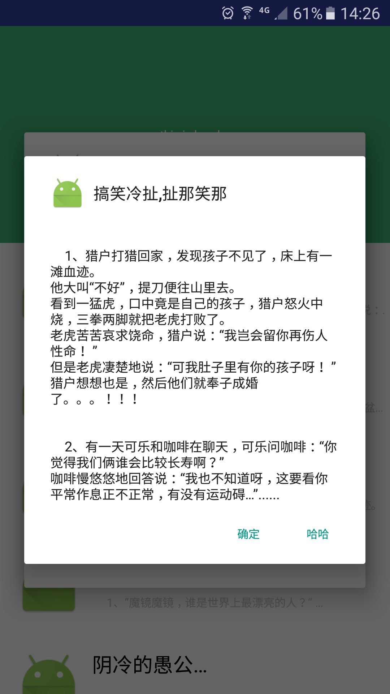

## 项目说明：

 在SettingFile.java里面有配置信息，测试的时候可以改成ShowApi下自己的账号信息，进行配置。
&emsp;  
&ensp;  
&ensp;

#### 历史版本
- ##### v1.0.6  Loading
  - 正在创建
  - 下一版本目标
    - 由以前的UrlConnection请求换成xutils框架
    - 增加下载二维码

- ##### v1.0.5  2016/12/29
  - 第一个稳定版本
  - 截图

#### 使用到的第三方框架
- fastjson
- xrecyclerview
- commons-lang
- xutils 3.0
